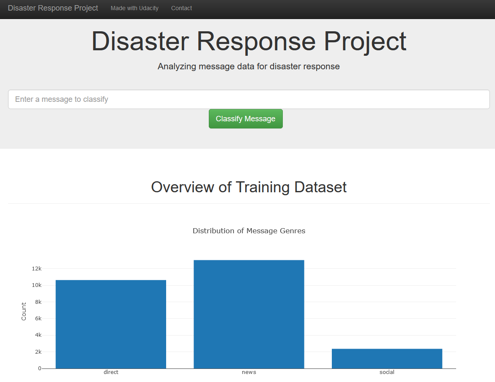

# Disaster Response Pipeline Project (udacity: Data Scientist Nanodegree)



The goal of this project is to develop a web application that can classify disaster data so that it can be forwarded to the right place.

For this purpose, an ETL pipeline is developed to read the data and the labels from CSV files. In addition, the data is cleaned in this step and loaded into a SQLite database.

In the second step, an ML pipeline is trained with the data from the database. The classifier is then loaded into a pickle file so that it can be used in the web application.

The web application also contains graphics that give an overview of the training and test data.

## Installation

The web app was developed in python 3.9.7.

The required libraries to run the notebook are:
```bash
pip install pandas scikit-learn plotly flask pickle nltk sqlalchemy
```

## Code Execution

The following steps are necessary in order to call the web app...
Run the ETL pipeline to clean the data and create the SQLite database:
```bash
python data/process_data.py data/disaster_messages.csv data/disaster_categories.csv data/DisasterResponse.db
```
2. run the ML pipeline to train a classifier:
```bash
python models/train_classifier.py data/DisasterResponse.db models/classifier.pkl
```
3. cd to the app folder, start the web application:
```bash
python run.py
```

In the browser, open the address http://0.0.0.0:3001/.

## File Descriptions

```bash
- README.md
- data: Code for the ETL-Pipeline aswell as the csv-data-files.
- models: Code for the ML pipeline and an ipynb that includes the development process and a grid search
- app: The Code to run the web app 
- WebApp.PNG: Overview of the web app
```

## Author
Author: Florian Pütz, florian.puetz@dlr.de